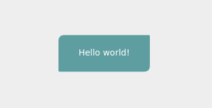

# Denim UI

A custom cross platform UI framework focused on fast and easy prototyping by the use of a custom DSL.

The various platforms are supported through separate backend implementations. An js backend that uses the canvas api for drawing and html for native components the only somewhat usable backend, but a native one is planned.

!!! warning
    Note that this project is still in an early phase, and subject to possibly large changes and breakages. Use at your own risk.

## Minimal example



```nim
import denim_ui
import denim_ui_canvas

proc render(): Element =
  panel:
    rectangle(
      color = colCadetBlue,
      radius = (10.0, 2.0, 10.0, 2.0),
      width = 150,
      height = 60,
      alignment = Alignment.Center
    )
    text(
      text = "Hello world!",
      fontSize = 14.0,
      color = colWhite,
      alignment = Alignment.Center
    )

startApp(
  render,
  "rootCanvas",
  "nativeContainer"
)
```


```html
<html lang="en">
	<body>
		<div id="nativeContainer">
			<canvas id="rootCanvas"></canvas>
		</div>
	</body>
	<!-- the bundle output by nim -->
	<script type="text/javascript" src="./dist/bundle.js"></script>
</html>
```

## Installation

Denim UI is provided through the nimble package manager:
```
requires "denim_ui"
```

### Backends

The only usable backend for denim UI is currently the canvas based javascript backend which can be added from nimble:
```
requires "denim_ui_canvas"
```

## DSL

Denim has a neat custom DSL for writing UIs. It allows one to easily create deep UI trees, as well as group parts of the UI into reusable components.

```nim
component MyButton(
  label: string,
  clicked: () -> void
):
  let isHovering = behaviorSubject(false)

  alignment = Alignment.Center

  rectangle(
    color <- isHovering.source.choose(colHotPink, colForestGreen)
  )
  text(
    text <- isHovering.source.choose("hovering", label),
    margin = thickness(10.0),
    color = colWhite
  )

  toggleOnHover(
    isHovering <- not isHovering.value
  )

  onClicked(
    proc(e: Element, args: PointerArgs, res: var EventResult) =
      if not isNil(clicked):
        # NOTE: Due to a quirk in the DSL, function props
        # needs to be surrounded with () before being called
        (clicked)()
  )

proc render*(): Element =
  myButton(
    label = "Hello!",
    clicked = proc() =
      echo "Button clicked"
  )
```

## The Element type

All the visual nodes in the UI tree inherit from the Element type.

`panel()`, for example, creates an element with the layout semantics of a panel (we'll get to layout soon).

### Attributes available on all element types:

- width: `Option[float]`
- height: `Option[float]`
- maxWidth: `Option[float]`
- minWidth: `Option[float]`
- maxHeight: `Option[float]`
- minHeight: `Option[float]`
- x: `Option[float]` The elements X-position in its parent
- y: `Option[float]` The elements Y-position in its parent
- xOffset: `Option[float]` An offset added to the X-position of the element after it has been arranged by its parent
- yOffset: `Option[float]` An offset added to the Y-position of the element after it has been arranged by its parent
- margin: `Option[Thickness[float]]`
- alignment: `Option[Alignment]`
- visibility: `Option[Visibility]`
- clipToBounds: `Option[bool]`
- transform: `seq[Transform]` A list of transforms added in order to the element after it has been arranged by its parent
- zIndex: `Option[int]` An index allowing an item to be drawn on top or below of its siblings. The higher the index, the more on top it is drawn.
- shadow: `Option[Shadow]`

!!! note "Note about all the options"
	Denim exports a converter from any type to Option, so you don't have to explicitly wrap all attribute values in an option:
	`converter toOption*[T](x: T): Option[T] = some[T](x)`. It has proven quite convenient when writing UI code, but can sometimes get in the way, as generic converters often tend to do.
	We would like to remove this converter and get the DSL to handle the conversion instead in the future.


#### Alignment

```nim
Alignment = enum
  Stretch, Left, TopLeft, Top, TopRight, Right,
  BottomRight, Bottom, BottomLeft, Center,
  CenterLeft, CenterRight, TopCenter, BottomCenter,
  HorizontalCenter, VerticalCenter
```

#### Visibility
```nim
Visibility = enum
  Visible, Collapsed, Hidden
```

## Layout

Layout is created using a set of elements that lays out its children in various ways.

### Panel

Panel performs the default layout on the children, where all children get all available space. The children of a panel will by default fill their entire space. If a panel contains several children, it simply layers them on top of each other.

```nim
panel(width = 100.0, height = 100.0):
  rectangle(color = colRed)
  circle(color = colBlue, radius = 25.0, alignment = Aligmment.Center)
```

### Dock

Lays out its children by docking them to the various sides, one after the other.

```nim
dock:
  dockLeft:
    rectangle(width = 10, height = 10, color = colRed)
  dockTop:
    rectangle(width = 10, height = 10, color = colBlue)
  rectangle(width = 10, height = 10, color = colYellow)
```

The last child element fills the remaining space.

### Stack

Stacks its children vertically by default. One can set the `direction` attribute to stack horizontally.

```nim
stack(direction = StackDirection.Horizontal):
  rectangle(width = 10, height = 10, color = colRed)
  rectangle(width = 10, height = 10, color = colBlue)
  rectangle(width = 10, height = 10, color = colYellow)
```

### Grid

Lays out children in a grid formation.

```nim
grid(
  width = 100.0,
  height = 100.0,
  rows = @[points(400.0), points(400.0)],
  cols = @[proportion(2.0), proportion(1.0)],
):
  rectangle(color = colRed)
  rectangle(color = colBlue)
  rectangle(color = colYellow)
  rectangle(color = colGreen)

```

The `rows` and `cols` attributes lets one customize the sizes of the rows and columns of the grid. Points lets you explicitly set the size of the row/column, while proportion lets you create row/cols that are proportionally sized relative to each other and the available size.

The children are placed automatically in grid cells, going from top to bottom, left to right.

| 1 | 2 |
|---|---|
| 3 | 4 |

## Visual primitives

The folowing element types are used for drawing various shapes and text.

### Rectangle

Draws a rectangle with optionally curved edges. It can be filled and/or stroked.

```nim
rectangle(
  color = colBlue,
  stroke = colRed,
  strokeWidth = 2.0,
  radius = (5.0, 10.0, 5.0, 10.0),
  width = 50.0,
  height = 20.0
)
```

!!! note
    `radius` is used to make the corners of the rectangle curved. It takes a tuple of four `float`, which assigns a radius to the four corners `(topLeft, topRight, bottomRight, bottomLeft)`

### Circle

Draws a circle with the specified radius. It can be filled and/or stroked.

```nim
circle(
  color = colBlue,
  stroke = colRed,
  strokeWidth = 2.0,
  radius = 50.0,
)
```

### Text

```nim
text(
  fontFamily = "Inter",
  fontSize = 24.0,
  color = colBlack,
  wordWrap = true
)
```

Setting `wordWrap` to true enables multiline text. If not, all the text is drawn on one line. It is `false` by default.

### Path

Draws a path using the provided data. The path can be filled and/or stroked.
The path data can either be a string as explained [here](https://developer.mozilla.org/en-US/docs/Web/SVG/Tutorial/Paths), or a list of `PathSegment`.

```nim
path(
  data = @[moveTo(0.0, 0.0), lineTo(10.0, 0.0), lineTo(5.0, 10.0), close()],
  lineDash = @[4, 2],
  lineCap = LineCap.Round,
  lineJoin = LineJoin.Bevel,
  stroke = colBlue,
  strokeWidth = 2.0
)
```
alternatively
```nim
path(
  data = "M 0 0 L 10 0 L 5 10 Z",
  ...
```

#### LineCap

```nim
LineCap =  enum
  Square, Butt, Round
```

#### LineJoin
```nim
LineJoin = enum
  Miter, Bevel, Round
```

#### LineDash

Line dash lets one specify a line pattern for the path.

For example
```
lineDash = @[4, 2]
```

results in a line like like:

```
----  ----  ----  ----
```

!!! note
    If the number of elements in the sequence is odd, the elements of the sequence get copied and concatenated. For example, [5, 15, 25] will become [5, 15, 25, 5, 15, 25]. If the array is empty, the line dash list is cleared and line strokes return to being solid.

## Native elements

Denim supports layering native elements to get access to for example text inputs and other native controls.

### TextInput

```nim
let content = behaviorSubject("")

proc textChanged(newVal: string): void {.locks: 0.} =
content <- newVal

textInput(
  text <- content.source,
  color = colBlack,
  fontFamily = "IBM Plex Sans",
  fontSize = 14.0,
  margin = thickness(10.0),
  placeholder = "Write something",
  onChange = some[TextChanged](textChanged)
)
```

!!! note
    Make sure you cast to Option[TextChanged] when assigning a handler to `onChange`, as the nim compiler
	is often not smart enough to infer the type correctly, and might give you a slightly misleading error message like
	`Error: type mismatch: got <Option[proc (newVal`gensym98: string){.locks: 0.}]> but expected 'Option[proc (i0: Error){.closure.}]'`

## Behaviors

Behaviors are used to respond to user input and other events, and can be attached to any alement.

### onClicked

Lets one react to an element being clicked (the pointer being pressed and released on the element)

```nim
rectangle(width = 50.0, height = 50.0, color = colRed):
  onClicked(
    proc(e: Element, args: PointerArgs, res: var EventResult): void =
      if not res.isHandled:
        echo "We are handling this clicked event"
        res.addHandledBy(e.id)
  )
```
!!! note
    The `EventResult` argument is used to keep track of who might already handled this event. This lets us make sure only we handle a clicked event, or if we want to, let other elements (like for example the parent element), also handle the event.

### onPressed/onReleased/onPointerMoved

Lets one react to the pointer being pressed/released/moved on the element.

```nim
rectangle(width = 50.0, height = 50.0, color = colRed):
  onPressed(
    proc(e: Element, args: PointerArgs, res: var EventResult): void =
      echo "We are pressing"
  )
  onReleased(
    proc(e: Element, args: PointerArgs, res: var EventResult): void =
      echo "We are releasing"
  )
  onPointerMoved(
    proc(e: Element, args: PointerArgs, res: var EventResult): void =
      echo "We are releasing"
  )
```

### onDrag

```nim
rectangle(width = 50.0, height = 50.0, color = colRed):
  onDrag(
    proc(amountMoved: Vec2[float]): void =
      echo "We dragged the pointer ", amountMoved
  )
```

`onDrag` can take a few more optional arguments:
- startedDrag: `() -> void`
- released: `() -> void`
- pointerIndex: `PointerIndex = PointerIndex.Primary`
- canStartDrag: `Observable[bool] = behaviorSubject(true).source`
- dragCaptureThreshold: `float = 6.0`

### onKey

Used to react to key presses.

```nim
rectangle(width = 50.0, height = 50.0, color = colRed):
  onKey(
    "Shift",
    proc(e: Element, a: KeyArgs) = echo("Shift was pressed"),
    proc(e: Element, a: KeyArgs) = echo("Shift was released")
  )
```

!!! note
    Only the focused element receives key events. See [focus](#focus) for more information about focus.

## Key bindings

TODO

## Observables and Subjects

Denim makes heavy use of [ReactiveX](http://reactivex.io/)-like observables provided by [rx-nim](https://github.com/nortero-code/rx-nim). See [data binding](#data-binding) for more examples of using observables with Denim.

## Animation

One can animate any attribute of any element type. It is achieved by binding it to an animated observable. An observable can easily be converted to an animated version by using the `animate(source: Observable[T], interpolator: (T,T,float) -> T, duration: float)` function.

```nim
let widthState = behaviorSubject(10.0)

rectangle(width <- widthState.source.animate(lerp, 250.0), height = 20.0, color = colRed):
  onClicked(
    proc(e: Element, args; PointerArgs, res: var EventResult) =
      widthState <- widthState.value + 10.0
  )
```

The above code increases the width of the rectangle by 10.0, every time it is clicked. The value is then interpolated over 250.0 ms, using a default linear interpolation function called lerp (which is implemented for a few types, like `float` and `Vec2[float]`). The animated value is then [data bound](#data-binding) to the `width` attribute.

## Focus

One can focus an element to ensure it receivs key events. Focused elements receive keyboard events.

### giveFocus(Element)

```nim
myElement.giveFocus(
  proc() =
    echo "Element lost focus"
)
```

Gives focus to `myElement`. The optional handler argument is called once the element loses focus (which might happen when a different element is given focus).

### clearFocus

```nim
clearFocus()
```

Unfocuses any focused element.

### releaseFocus(Element)

```nim
myElement.releaseFocus()
```

Releases focus if it is currently held by the supplied by `myElement`.

### hasFocus(Element) -> Observable[bool]

Returns an `Observable[bool]` that pushes a new value whenever the focused state of the element changes.

```nim
myElement.hasFocus().subscribe(
  proc(val: bool) =
    echo "Element focus changed to: ", val
)

```

### isFocused(Element) -> bool

Returns whether the element is currently focused.

### Other focus related functions

- `getCurrentlyFocusedElement() -> Option[Element]`
- `focusNext()` Assigns focus to the next sibling of the currently focused element (if it has one).

## Update manager

Sometimes, we need to be able to schedule an action to happen each frame, or one on the next frame.
This can be done using a few functions provided by the update manager (which is available by default).

### wait

```nim
type Dispose = () -> void
proc wait(callback: () -> void, waitFor: float): Dispose
```

Can be used to schedule an event to happen after a given number of milliseconds.

The returned `Dispose` handler can be called to unschedule the handler before it gets called.

### Perform next frame

```nim
proc performNextFrame(callback: () -> void): void
```

Lets you schedule an action to be performed in the beginning of the next frame, after layout has been recalculated.

## Capturing

Capturing provides a means of making sure an element receives pointer events even if the event occurs outside the elements bounds. This is useful when for example dragging, as the pointer might be dragged outside the element between frames.

### capturePointer(Element, [Option[() -> void]])

Captures the pointer to the supplied element. An optional callback can be supplied, which is called when the element loses capture.

### releasePointer(Element)

Releases the pointer capture, if it is currently held by the supplied element.

### Other capture related functions

- `hasPointerCapture(Element) -> bool`
- `pointerCapturedBySomeoneElse(Element) -> bool`

## Cursors

There are a few ways of changing the pointer cursor.
The simplest is to call the `setCursor(Cursor)` function.

A better alternative is to use the `cursorOnHover(Cursor)` or `cursorWhilePressed(Cursor, PointerIndex)` behaviors.

Three are currently only three cursors implemented, but more will be added.

```nim
Cursor = enum
  Default, Clickable, Dragging
```

## Data binding

For dynamic data, we use the Observable pattern, which works pretty much as RX observables (http://reactivex.io/intro.html), sans some missing operators.

We can bind observables to attributes using the `<-` operator:

```nim
let widthValue = behaviorSubject(100.0)
panel(width <- widthValue)
```

We can also dynamically create a list of child elements using the spread operator `...`:

```nim
let someChildren = observableCollection(@[panel(), text(), rectangle()])
panel:
  ...someChildren
```

Note that the spread operator currently works for the following types:
- `seq[Element]`
- `Subject[Element]`
- `Subject[Option[Element]]`
- `Subject[seq[Element]]`
- `Observable[Element]`
- `CollectionSubject[Element]`

More can be supported by simply creating a `proc` with the following signature:

```nim
proc bindChildCollection*(self: Element, items: THE_TYPE_TO_SUPPORT): void =
   ...
```

This proc should set up the necessary subscriptions that manipulate the elements children using `addChild` and `removeChild`.

Here is an example of how the implementation for `Subject[Element]` works:

```nim
proc bindChildCollection*(self: Element, item: Subject[Element]): void =
  var prevElem: Element
  discard item.subscribe(
    proc(e: Element): void =
      if not isNil(prevElem):
        self.removeChild(prevElem)
      prevElem = e
      self.addChild(e)
  )
```

## Components

Components lets us create reusable element types more easily, and can be defined like so:

```nim
component ComponentName(prop1: AttrType1, prop2: AttrType2):
  let foo = "bar"

  panel:
    text(text = foo)
```

Component bodies can contain whatever code (almost) you want, as long as it return an element.

The component can then be used with the DSL syntax like any other element:

```nim
panel:
  componentName(prop1 = ....
```

NOTE: Components should be named with an upper case first letter, but are instantiated with lower case.

### Component fields

One can add fields to a component using the field keyword:

```nim
component Foo():
  field myField: float = 10.0
  ...
```

This field can the be accessed as a property on an instance of the component:

```nim
let f = Foo()
echo "myField is: ", foo.myField
```

This is useful if one wants to expose certain parts of a component to the outside world.

!!! warning "Databinding doesn't work for component properties"
    Since the properties are just passed by value as parameters to the component body, if you want property values of component children to be changed dynamically, they need to be passed as Observables:

    ```
    component MyDynamicComp(val1: Observabie[float]):
      panel(width <- val1)
    ```
