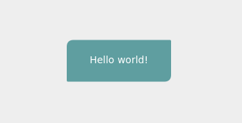

# Denim UI

A custom cross platform UI framework focused on fast and easy prototyping by the use of a custom DSL.

The various platforms are supported through separate backend implementations. An js backend that uses the canvas api for drawing and html for native components the only somewhat usable backend, but a native one is planned.

[Documentation can be found here](https://nortero-code.github.io/denim-ui/)

## Use at your own risk

Note that this project is still in an early phase, and subject to possibly large changes and breakages. Use at your own risk.

## Minimal example



```nim
import denim_ui
import denim_ui_canvas

proc render(): Element =
  panel:
    rectangle(
      color = colCadetBlue,
      radius = (10.0, 2.0, 10.0, 2.0),
      width = 150,
      height = 60,
      alignment = Alignment.Center
    )
    text(
      text = "Hello world!",
      fontSize = 14.0,
      color = colWhite,
      alignment = Alignment.Center
    )

startApp(
  render,
  "rootCanvas",
  "nativeContainer"
)
```


```html
<html lang="en">
	<body>
		<div id="nativeContainer">
			<canvas id="rootCanvas"></canvas>
		</div>
	</body>
	<!-- the bundle output by nim -->
	<script type="text/javascript" src="./dist/bundle.js"></script>
</html>
```

## Installation

Denim UI is provided through the nimble package manager:
```
requires "denim_ui"
```

### Backends

The only usable backend for denim UI is currently the canvas based javascript backend which can be added from nimble:
```
requires "denim_ui_canvas"
```
